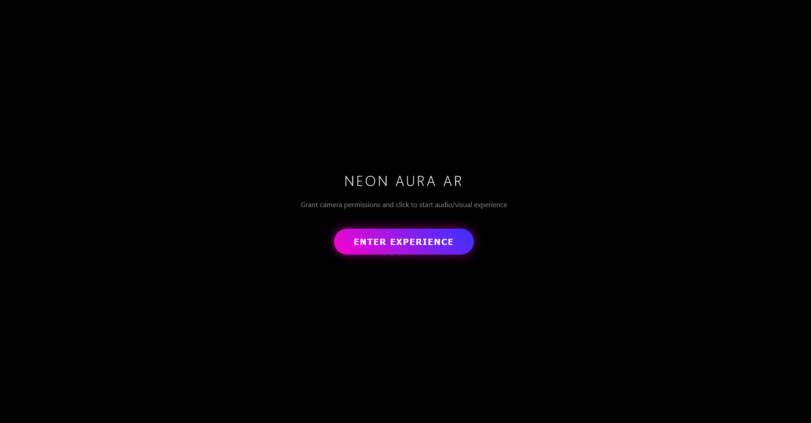

# 🌌 Neon Hand Gesture Visualizer ✋✨

A futuristic **real-time hand-tracking AR experience** built using **MediaPipe + JavaScript**.
This project transforms your hand movements into **dynamic neon visuals, particle effects, gesture-based interactions, and reactive audio**.

---

## 🧱 Project Structure

```bash
neon-hand-gesture-visualizer/
│
├── index.html            # Main UI structure
├── main.js               # Core logic
├── styles.css            # Styling & UI design
├── LICENSE               # MIT LICENSE
└── README.md             # Project documentation
```

---

## ✨ Features

### ✋ Real-Time Hand Tracking

* Uses **MediaPipe Hands**
* Detects up to **2 hands simultaneously**
* Tracks **21 landmarks per hand**

### 🎯 Gesture Recognition

* 🤏 Pinch Detection (Thumb + Index)
* ✋ Open Hand Detection
* ✊ Fist Detection
* Live gesture feedback on screen

### 🎨 Neon Visual Effects

* Glowing **hand skeleton rendering**
* Dynamic **color themes**
* Smooth **motion trails**
* Gradient-based lighting effects

### ⚡ Interactive Effects Engine

* 💥 Shockwave effect on pinch
* ✨ Particle system from fingertips
* ⚡ Lightning between both hands
* 🌀 Mandala-style pattern rendering

### 🌧️ Matrix Background System

* Animated **matrix rain effect**
* Speed reacts to **hand movement velocity**
* Creates immersive cyberpunk feel

### 🔊 Reactive Audio System

* Built using **Web Audio API**
* 🎵 Ambient hum sound (based on hand distance)
* ⚡ Zap sound on pinch gesture
* Real-time audio modulation

### 🎭 Theme Switcher

* Rainbow 🌈
* Cyberpunk 💜
* Lava 🔥
* Ocean 🌊
* Galaxy 🌌

### 📊 Live HUD (Heads-Up Display)

* Hands detected
* FPS counter
* Current gesture
* Hand spread %

---

## 🛠 Technologies Used

| Technology          | Role                        |
| ------------------- | --------------------------- |
| **JavaScript**      | Core logic & interaction    |
| **MediaPipe Hands** | Hand tracking (AI model)    |
| **HTML5 Canvas**    | Rendering visuals & effects |
| **Web Audio API**   | Sound generation            |
| **CSS3**            | UI styling (Glassmorphism)  |

---

## 📌 Requirements

* Modern browser
* Webcam access required
* Internet (for CDN libraries)

---

## ▶️ How to Run

### 1️⃣ Clone Repository

```bash
git clone https://github.com/ShakalBhau0001/neon-hand-gesture-visualizer.git
```

### 2️⃣ Navigate to Project

```bash
cd neon-hand-gesture-visualizer
```

### 3️⃣ Run Project

* Open `index.html` in browser
* Allow **camera permission**(`Required`)
* Click **Enter Experience**

### 🖥️ What You'll See

* 🎥 Live camera feed (mirrored)
* ✋ Hand skeleton with neon glow
* ✨ Particles from fingertips
* ⚡ Lightning between hands
* 🌧️ Matrix-style animated background
* 📊 Live HUD with stats

---

## ⚙️ How It Works

### 1️⃣ Hand Detection

* MediaPipe processes video frames
* Detects hand landmarks in real-time

### 2️⃣ Gesture Processing

* Calculates distance between fingers
* Identifies pinch, open hand, fist

### 3️⃣ Rendering Engine

* Canvas draws:

  * Skeleton
  * Particles
  * Shockwaves
  * Lightning

### 4️⃣ Audio Engine

* Generates real-time sound
* Reacts to gesture & hand distance

---

## ⚠️ Limitations

* Requires good lighting for accurate detection
* Performance depends on device GPU/CPU
* Mobile support limited

---

## 🌟 Future Enhancements

* 📱 Mobile optimization
* 🧠 More advanced gestures
* 🌐 Three.js 3D integration
* 🎥 Recording / export feature
* 🎮 Gesture-based controls

---

## 📸 Preview



---

## 🪪 Author

> **Creator: Shakal Bhau**

> **GitHub: [ShakalBhau0001](https://github.com/ShakalBhau0001)**

---

## 💙 Support

If you like this project:

* ⭐ Star the repo
* 🍴 Fork it
* 🚀 Share it

---

> ✨ *Move your hands. Create magic.* ✨

---
